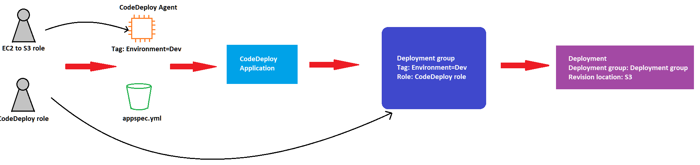

# AWS CICD CodeCommit, CodePipeline, CodeBuild, CodeDeploy

## CodeCommit
- A git repo
- Private and no size limit, highly available
- Code only in AWS Cloud account which increases security
- Integrate with build tools like Jenkins or CodeBuild
- Authentication:
  - SSH keys: config SSH keys in IAM console
  - HTTPS: Create Git credentials in IAM console
- Authorization: IAM policies allow to manage users/roles permissions to repos
- Encrypted by default
- Cross-account Access: should not share SSH keys or AWS credentials, should use STS token instead
- It's possible to create `Notifications` and `Triggers` to send notifications to SNS, AWS Chatbot or Lambda whenever code commit, pull request created, approved, new branch created, pushed to existing branch ...etc...
- Go to `Settings` => `Notifications` or `Triggers` to create
- To create Git credentials or upload SSH public key, go to `IAM` => `Users`, after set up git credentials or SSH in local, can clone and push code

## CodePipeline
- Tool to orchestrate CICD
- Can specify 
  - Source: CodeCommit, ECR, S3, Bitbucket, Github
  - Build: CodeBuild, Jenkins, CloudBees, TeamCity
  - Test: CodeBuild, AWS Device Farm, some 3rd party tools...
  - Deploy: CodeDeploy, Elastic Beanstalk, CloudFormation, ECS, S3...
- Consist of stages, each stage is a sequence or parallel of actions
- At the end of each stage, there is an artifact created and will be stored in S3 bucket, the next stage will pick up from S3 and does the same thing.
- Use `CloudWatch` to troubleshoot CodePipeline state chages, for example can create events for failed or cancelled stages
- If `CPL` fails a stage then the whole pipeline will stop, can check error in the console
- if `CPL` cannot perform an action, make sure the `IAM Service Role` attached has enough permissions
- Can also use CloudTrail to check API calls, this is an AWS service to audit API calls
- A service role is like an IAM role but created for services instead of users

### Create a code pipeline
- Go to CodePipeline => Create pipeline, specify name and `Service Role` (can create a new one)
- For encryption, by default it uses KMS, we need to allow the Service Role to use one of the keys in KMS 
- By default, CodePipeline has 3 stages: 
  - `Source`: Specify the sources code such as CodeCommit or ECR ...
  - `Build`: Specify the build tool
  - `Deploy`: Specify where to deploy like Beanstalk, EC2 or S3...
- It's possible to create more stages and add action groups, these groups can be sequential or parallel
- Each action group contains a bunch of actions, these actions could be `Deploy to Beanstalk`, `Waiting for manual approval`... 

## CodeBuild
- `CodeBuild` takes source from Source and run some commands to build
- The config file is `buildspec.yml` in root source directory
- Output logs can be store in S3 or CloudWatch Logs
- Can use `CF Metrics` to monitor build statistics, `Events` to detect failed builds and trigger notifications, `Alarms` to notify exceeding thresholds for failures
- Build Projects can be defined within `CodePipeline` or `CodeBuild`
- `CodeBuild` can support multiple languages or use Docker
- By default `CodeBuild` runs outside of `VPC`, to access the resources inside `VPC` like `RDS`, `ElastiCache` ... we need to specify VPC IDs, subnet IDs, sec group IDs

### buildspec.yml
- `env`: define environment variables
  - `variables`: plaintext variables
  - `parameter`-store: variables pulled from param store
  - `secrets-manager`: variables pulled from Secret Manager
- `phases`: specify commands to run
  - `install`: install dependencies
  - `pre_build`: final commands to execute before build
  - `build`: the actual build command
  - `post_build`: finishing touches such as zipping files
- `artifacts`: which file to upload to S3 (encrypted with KMS)
- `cache`: which files to cache, for example Maven .m2

### Create a build project
- Go to `CodeBuild` => `Create Build Project` => specify project name, source, branch
- Specify the build environment, could be Linux or Docker, `Service role` just like `CodePipeline`
- Additional configuration includes VPC, timeout ...
- Specify name of the specbuild.yml file, name of S3 bucket to store the artifacts, logs ...
- Go to `CodePipeline`, add new stage between `Source` and `Deploy`, select `CodeBuild`
- Specify name of the artifact, could be `SourceArtifact` or the name we gave in `CodeBuild` project
- Specify the `CodeBuild` project we just created

## CodeDeploy
- To deploy app to EC2 instances, these instances are not managed by Beanstalk 
- Each EC2 instance or on-premises must run `CodeDeploy Agent`
- Config file is `appspec.yml`
- `CodeDeploy Agent` constantly ask `CodeDeploy` is there is anything to deploy
- Once a deployment is ready, code + appspec.yml file will be pulled from repo or S3 
- EC2 instances will run the deployment instructions in the config file
- `CodeDeploy Agent` will report success/failure status of the deployment

### appspec.yml
- `files`: how to source and copy from S3/Github to filesystem
  - `source`
  - `destination`
- `hooks`: set of instructions to do to deploy the new version (can have `timeout`), the order is:
  - `ApplicationStop`
  - `DownloadBundle`
  - `BeforeInstall`
  - `Install`
  - `AfterInstall`
  - `ApplicationStart`
  - `ValidateService`: ***IMPORTANT*** checks if the application is deployed successfully

### Deployment Configuration
- Configurations:
  - `One At A Time`: one EC2 instance a time, if 1 instance fails then the deployment stops
  - `Half At A Time`: 50%
  - `All At Once`: quick but no health host, downtime, good for dev
  - `Custom`: minimum healthy host = 75%
- Failures:
  - EC2 instances stay in `Failed` state
  - New deployments will first be deployed to failed instances
  - To rollback, either redeploy the old version or enable automated rollback for failures
- Deployment Groups:
  - A set of `tagged` EC2 instances
  - Directly to an ASG
  - Mix of ASG/tags so you can build deployment segments
  - Customization in scripts with `DEPLOYMENT_GROUP_NAME` environment variables

### Create Deployment
#### Step 1: Create roles for CodeDeploy and EC2 instances
- To create deployment in CodeDeploy, we first need to create 2 IAM service roles
  - CodeDeploy role: We need a role for CodeDeploy to access other services during deployment. Select CodeDeploy => select the default policy and create new role
  - EC2 role: Since EC2 needs permission to pull artifacts from S3, we need to create a role for it with policy `AmazonS3ReadOnlyAccess`
#### Step 2: Create EC2 instances
- We need to create an EC2 instance so we can deploy to, go to EC2 and create new instance with the created IAM service role, enable traffic on port 80.
- Connect to the instance and install CodeDeploy Agent

#### Step 3: Create S3 bucket and upload code
- Go to S3 to create a bucket
- Upload the project zip file to the bucket, inside the source folder there should be an `appspec.yml` file to guide how to run the project

#### Step 4: Create CodeDeploy Application
- Go to CodeDeploy => Create new application => EC2/On-premises

#### Step 5: Create Deployment group
- Each Deployment group is a set of EC2 instances that we deploy to, which means we can have some groups to deploy to such as `Dev`, `Prod`...
- Go to EC2 instance and add a tag `Environment` = `Dev`
- Go to `Create deployment group`, specify the name
- Service role is the role of CodeDeploy that we created earlier
- For `Environment configuration`, select `Amazon EC2 instances` (because we're deploying to an EC2 instance), the key and value are the tag that we added to the instance so that only instances of this tag are included in the `Deployment group`
- For `Deployment settings`, select the Deployment config (all at once, on at a time ...) then `Create deployment group`

#### Step 6: Create Deployment
- Back to the `CodeDeploy`'s deployment group, `Create deployment`
- The Deployment group is the one we created for dev environment before 
- The Revision location is the URI to the uploaded file in bucket
- `Create deployment`

## CodeDeploy with EC2
- We can use appspec.yml + deployment strategy to define how to deploy to EC2
- Will do in-place update to the fleet of EC2 instances
- Can use hooks to verify the deployment after each deployment phase
  
### CodeDeploy with ASG
#### In-place deployment
- Update existing EC2 instances
- Newly created instance will get automated deployments

#### Blue/Green
- Must use ALB
- A new ASG is created, both old and new ASG connect to ALB
- When health check is ok, ALB will automatically switch to the new version
- Can select how long to keep the old ASG

#### Redeploy and Rollbacks
- `Rollback` = redeploy a previous deployed version 
- We can set `Deployments` to be rolled back manually or automatically when CloudWatch alarm
- We can disable `Rollbacks`
- When `Rollbacks` happen, `CodeDeploy` will deploy a last known working version as a new version, instead of falling back.

## AWS CodeStar
- An integrated solution that groups GitHub, CodeCommit, CodeBuild, CodeDeploy, CloudFormation, CodePipeline, CloudWatch together
- Quickly create CICD-ready projects for EC2, Beanstalk, Lambda
- Supports multi languages
- One dashboard to view all components
- Issue tracking tools like Jira, GitHub
- Free, only charges for underlying services, limited customization

## AWS CodeArtifact
- Dependencies management which is scalable, cost-effective and secure
- Works with common dependency management tools like Maven, Gradle, npm, yarn, twine, pip and NuGet
- Developers and CodeBuild can then retrieve dependencies straigt from CodeArtifact
- It's basically Maven on cloud

## AWS CodeGuru
- Machine learning code review
- CodeGuru Reviewer: Automated code reviews for static code analysis
- CodeGuru Profiler: Gives recommendations to improve performance
- CodeGuru looks into commits
- Support Java and Python