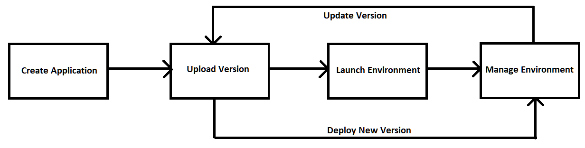

# Amazon Beanstalk

- Beanstalk is a managed service that provisions load balancing scaling, health monitoring, instance config
- The developer just needs to handle the code but still has full control over the config
- Beanstalk is free but charged by underlying resources
- Beanstalk components are:
    - `Application`: collection of Elastic Beanstalk components (env, versions, config)
    - `Application Version`: an iteration of code
    - `Environment`: 
        - Collection of AWS resources runnign an application version (only 1 application version at a time)
        - Tiers: Web Server Environment Tier and Worker Environment Tier
        - You can create multiple environment UAT, dev, prod

- Beanstalk supports multi languages
- `Web Environment` is when we have an `ALB` to receive traffic from client and process. 
-` Worker Environment` is when we don't have an `ALB` but an `SQS` and the instances will pull messages from the queue to process, they can scale up/down based on the number of messages
- We can combine both environments so that `Web Environment` can send messages to `SQS` for `Worker Environment` to process

## Create a Beanstalk application
- Go to Beanstalk => Create Application, specify name and platform.
- Beanstalk will automatically create new ALB, EC2 instance, sec group, domain, S3 ... in the background.
- After the process is complete, we can upload new version of code
- Can create anothe environment of the app like `dev` or `prod` by going to `Environment` => `Create a new environment`

## Create another environment
- When create environment, we are asked whether we want to create web env or worker env
- Specify application and environment names, platform, upload new code or use existing application.
- To have deeper config, instead of clicking Create environemnt, go to Configure more options
- We can config ALB, scaling, software, instances ...
- If we configure an RDS inside Beanstalk, when we delete the envinroment, it will be erased as well

## Beanstalk Deployment Modes (important)
- `All at once`: fastest but instances have down time for a while, no additional fee
- `Rolling update`: update a few instances at a time and gradually update all instances, availability suffers a bit
- `Rolling with additional batches`: like rolling but spins up new instances to move the batch so that the old instances are still available at the mean time, small additional cost, good for prod
- `Immutatble`: spins a new temp ASG with new instances, deploy new version there and when everything is healthy, move there instances to the current ASG and remove old version instances, high cost since we double the capacity, takes longest time but can quick rollback in case of failure, good for prod.
- `Blue\Green`: create a new staging environment and deploy new version there for testing, use Route53 to redirect 10% of users to the new environment, when all testing is done then swap the URL
- `Traffic Splitting`: similar to `Blue\Green` but everything is automated, when a failure happens, all the traffic will be switched back to the main ASG, no DNS change needed like `Blue/Green`, good for canary testing

## Create a deployment
- To edit the deploy mode, go to the Environment => `Configuration` => `Rolling updates and deployments`
- Select the deployment mode
- For `Rolling` and `Rolling with batch`, we need to select the percentage or fixed number of instances to be removed/added then save the changes
- Click `Upload and deploy` to deploy new code, Beanstalk will spin up new ASG depends on the mode
- After the deployment process is done, go to the can check the URL of the environment
- For `Blue/Green`, to swap URL, select the environment to swap, click `Actions` => `Swap environment URLs`

## Beanstalk Lifecycle Policy
- Beanstalk allows up to 1000 application versions
- We need to delete old versions otherwise won't be able to deploy new versions
- We can use lifecycle policy
- Go to `Application versions` => select the application => Settings => Enable Lifecycle policy and set the number of versions before delete, whether to keep the deleted versions in S3...

## Beanstalk Extensions
- When uploading a zip file of code to Beanstalk, it's possible to include some config files in the root source folder
- These config files have to be in `.ebextensions/` directory, has YAML/JSON format but the file extension has to be `.config`
- Using these files, we can modify some default settings, add new resources such as RDS, ElastiCache...

## Beanstalk and CloudFormation
- Beanstalk uses CloudFormation as foundation
- Can define CloudFormation resources in ebextensions files to provision ElasticCache, S3 or anything else despite the Beanstalk's UI does not cover

## Beanstalk Cloning
- Allow to create new environment with the same config
- Can create a test env when already have a prod env
- All resources and config are preserved:
    - Load Balancer type and config
    - RDS database type (but data is not preserved)
    - Environment variables
- After cloning the environment, we can change settings
- To clone, select the environment => `Actions` => `Clone environment`

## Beanstalk Migration

### Load Balancer
- After creating an environment, we cannot change the LB type
- To migrate, create a new environment with same config except LB, we cannot clone because LB will be copied over
- Deploy the app onto the new environment
- Perform CNAME swap or Route53 update

### RDS
- If we deploy RDS within Beanstalk, when deploy prod, we don't want to include the database of dev env
- To decouple RDS, create a snapshot of the DB as a safeguard.
- Go to RDS console and enable deletion protection
- Create a new Beanstalk environment without RDS, point the app to the existing RDS in old env using connection string (env variable)
- Perform CNAME swap or Route53 and confirm everything is working
- Terminate the old environment
- Because RDS deletion protection is enabled, the database will stay when the env is deleted
- Because CloudFormation fails to delete RDS, there will be a failed stack, we need to delete this failed stack in CloudFormation (not really important)

## Beanstalk and Docker
- It's possible to run Docker containers on Beanstalk
- We need to provide a Dockerfile or a Dockerrun.aws.json (describes where the image is) in source code
- Beanstalk in Single Docker Container will run the container on EC2, not ECS
- If we want to run multi containers on Beanstalk then it will use ECS.
- Beanstalk will create the cluster, EC2 instances, ALB, task definition and execution.
- We just need to provide Dockerrun.aws.json (v2), this file is used to generate task definition.
- But when we use Dockerrun.aws.json, the image has to be already built and stored in ECR or Dockerhub.

## Beanstalk HTTPS
- To have HTTPS wit Beanstalk, we can upload SSL cert to the Load Balancer
- This can be done from console or `.ebextensions/securelistener-alb.config`
- SSL cert can be provisioned using ACM
- Must config security group of ALB to allow traffic on port 443
- To redirect HTTP to HTTPS, can config Beanstalk or write a rule in LB (ALB only)
- Make sure health checks are not redirected

## Beanstalk Custom Platform
- When we use a language not supported by Beanstalk and cannot run Docker, we can use Custom Platform to define from scratch
- Needs to define an AMI using Platform.yaml
- Build the platform using Packer software
- Custom Image is to tweak existing Beanstalk platform
- Custom Platform is to create a new platform 