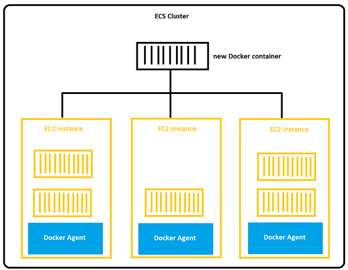
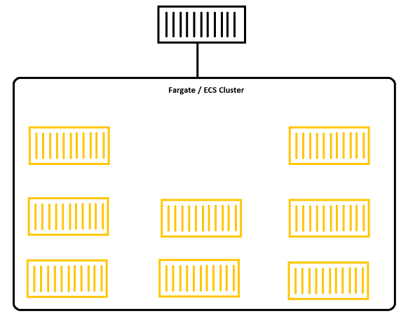

# Docker in AWS

- AWS ECR is a repository for Docker images
- AWS ECS and EKS is a platform for containers to run on
- Fargate is a serverless container platform that works with both EKS and ECS

## ECS
- When launching ECS, we're launching ECS tasks on ECS Clusters
### EC2 Launch Type
- For EC2 launch type, need to provision and maintain the infra
- Each EC2 instance will have a ECS Agent to launch ECS tasks and register with the cluster
- AWS will takes care of stating/stopping the container



### Fargate Launch Type
- Don't have to provision the infra or manage EC2 instances
- It's serverless
- Just need to create task definitions, can increase number of tasks to scale.
- AWS will run these tasks with the specified CPU/RAM 
  


### IAM Roles for ECS
- `EC2 Instance Profile` is for `EC2 Instance Launch Type` only
- It's used by ECS agent to call different services like `CloudWatch`, `ECR`,` Secret Manager`, `Param Store`
- `ECS Task Role` is for both `EC2 instance` and `Fargate` launch type.
- It's used by tasks 
- Each task uses different role because they need to call different AWS services like S3, RDS ...
- `Task Role` needs to be defined in `Task Definition`

### Load Balancer Integration
- Can create an ALB in front of the ECS Cluster
- NLB is only recommended when lots of throughput is required
- ELB is supported but there is no point to use it
  
### Data Volume (EFS)
- EFS works for both EC2 and Fargate
- Tasks running in different AZ will share the same data
- Farget + EFS = Serverless
- S3 cannot be mounted as a file system

### Create ECS Cluster
- Go to ECS => Create Cluster and specify the name
- It's possible to launch both Fargate(selected as default) and EC2 launch type
- If EC2 Launch type is also selected then need to specify the OS, instance type, number of instances
- After the cluster is created, in the Infrastructure tab, there should be 3 `Capacity Provider`:
  - 1 is to launch Fargate containers
  - 1 is to launch Fargate Spot containers (same as EC2 Spot fleet, cheaper but can be interrupted)
  - 1 is for AGS to launch EC2 instances
### Create Task Definition
- Go to `Task Definition`, specify name
- In the Container - 1 (can have multiple containers), specify name of the container and the URL to its image, click `Next`
- In the config env page, select to launch this on `Farget` or `EC2`, or both
- Select `CPU/RAM` for the task
- Specify the `IAM Task role` if the container needs to call external services, before that need to create an IAM Role and attach the policies accordingly
- Can mount volume if needed
- Click `Next` then `Create` 

### Deploy a service
- After creating a definition, to deploy, we need an ALB.
- To have an `ALB`, we need to define 2 security group in `EC2`:
  - 1 is for the `ALB` to allow external traffic coming in
  - 1 is for the task/service to allow traffic from the `ALB`'s security group only
- Go to ECS cluster => `Deploy`
- Select `Service` for a bunch of tasks or `Task` for just 1 Task
- Select the container image and the revision (version)
- In Load Balancer, select Application Load Balancer.
- Can use an existing ALB or create a new one
- Specify number of tasks (default is 1, if 0 then no task is running)
- In `Networking`, select the Security group for the task, this option will also be applied for the load balancer we just created, which is **WRONG** and needs to be fixed later
- Click `Deploy`
- While the creation of `Task`/`Service` is running, go to EC2 and check the `Load Balancer` we created (or using from an existing one)
- The security group of this `ALB` is the same one of the `Task`/`Service` which is **WRONG** and not public.
- Change the security group to the `ALB`'s security group that we created
- Now we have the `ALB` with security group allowing the public traffic and the `Service`/`Task` with the security group allowing only traffic from the ALB's security group
- After the service is deployed, use the DNS of the ALB to access
- To scale the Service/Task, go to Edit and change the Desired Tasks, if it's 0 then there is no task running

### ECS Service Auto Scaling
- Auto increase/decrease number of ECS tasks
- `ECS Auto Scaling` uses `AWS Application Auto Scaling` which scale CPU, RAM, ALB
- `Target Tracking`: scale based on target value for a specific `CloudWatch` metric
- `Step Scaling`: based on `CloudWatch` Alarm
- `Scheduled Scaling`: specified date/time
- ECS Service Auto Scaling at task level does not equal EC2 Auto Scaling at instance level
- This is why Fargate is better at scaling because we don't have to manage the instances

### EC2 Launch Type - Auto Scaling EC2 Instances
- Adds underlying EC2 instances
- `Auto Scaling Group Scaling`:
  - Scale ASG based on CPU utilization, provided by `CloudWatch`
  - Add EC2 instance over time
- `ECS Cluster Capacity Provider`(recommended):
  - Auto provision and scale the infra for ECS tasks
  - Capacity Provider paired with an Auto Scaling Group
  - Add new instances when missing capacity

### ECS Rolling Updates
- When updating from v1 to v2, we can control how many tasks can be started and stopped, in which order
- For example, when the Min = 50% to be considered Healthy, Max is 100% and we have 4 tasks running:
  1. 2 tasks will be removed => 50%
  2. 2 new tasks of v2 are added => 100%
  3. The last 2 v1 tasks are removed => 50%
  4. 2 new tasks of v2 are added and the rolling update is complete

- If Min = 100% (we want all tasks are up 100% all the time) and Max = 150% then:
  1. 2 tasks v2 are added => 150%
  2. 2 tasks v1 are removed => 100%
  3. 2 tasks v2 are added => 150%
  4. The last 2 v1 tasks are removed, the  rolling update is complete

### Solution architecture
1. We may have an ECS cluster with Fargate running. 
    - User sends an object to S3, S3 is integrated with `EventBridge`. 
    - `EventBridge` has a rule to create a task in ECS cluster to get the object from S3, process it and send to DynamoDB
2. We can have the `EventBridge` to periodically sends an event to create a new task in ECS cluster to do batch processing, then send the result to S3
3. We can have an `SQS Queue` receiving messages from other services
    - The tasks in cluster pull messages from `SQS` and process them
    - We can have an `ECS Service Auto Scaling` to scale up and down the number of tasks if there are too many messages to process
    - The `Service Auto Scaling` may scale based on CPU utilitzation

### Task Definitions
- `Task Definitions` are metadata in JSON to tell ECS how to run Docker containers
- It contains some info such as:
  - Image name
  - Port binding for containers and Host
  - RAM and CPU 
  - Environment variables
  - Networking info
  - IAM Role
  - Logging config (`CloudWatch`)
- We can define up to 10 containers
- When create a Task Definition, an Essential container is the container that when it stops, all containers stop

#### Load Balancing EC2 Launch Type
- If we don't specify the ports then we get `Dymanic Host Port Mapping`, which means each task in the EC2 instance will have a random port
- When `ALB` connects to the instances, it will automatically find the ports
- Because the ports are random, we need to config the **security group of the instance** to accept traffic from the **ALB's security group** on **all the ports**.
- If we define mapping from container's ports to host's ports then make sure the host's ports don't overlap

#### Load Balancing Fargate Launch Type
- Because Fargate is serverless so we don't have any host
- Each task has a unique private IP and connect to an ECS ENI
- These ENIs all run on port 80
- When ALB connects to the cluster, it just needs to connect to port 80 of the ENIs
- The ECS ENI's sec group needs to allow ALB's sec group on port 80
- ALB's sec group needs to allow traffic from the Internet on port 80/443 (if HTTPS)

#### IAM Role
- Each Role is attached to a task definition, not the whole service

#### Environment Variables
- When defining tasks, we can define Environment variables such as hardcoded URLs
- If there is sensitive info then we need to store it in param store and only load it on start up.

#### Data Volumes(Bind Mounts)
- We can attach `Bind Mounts` volume to 1 or many tasks so they can share the data
- `Bind Mounts` are diffrent from `EFS`, mostly because of their lifecycles.
- When attached to Fargate, `Bind Mounts` is removed and all data is lost when the containers they're attached to all stop
- When attached to EC2, `Bind Mounts` are essentially the EC2 instance's storage, their lifecycles is tied to the EC2 instance's lifecycle
- `Bind Mount` can range from 20-200GB.
- `EFS` can also be attached to tasks at `Task Definition` step

### Task Placement
- When launching EC2 type, ECS needs to decide where to place it with the constraint of CPU and RAM
- When ECS scale up and down, it also needs to decide where to add/remove containers
- To assist this, can define `task placement strategy` and `task placement constraint`
- Task placement strategies are the best option
- When ECS select an instance to place a container, it uses the following process:
  - **Step 1**: Identify the instances that satisfy CPU, RAM and port requirements
  - **Step 2**: Instances that satisfy task placement constraints
  - **Step 3**: Instances that satisfy task placement strategies
  - **Step 4**: Select the instance for task placement

#### Task Placement Strategy
- `Binpack`:
  - Based on the least available amount of CPU or RAM
  - Save money, it tries to place as many containers in an instance as possible before moving to another instance
  ```
  "placementStrategy": [
    {
      "field": "memory",
      "type": "binpack"
    }
  ]
  ```
- `Random`: place randomly
  ```
  "placementStrategy": [
    {
      "type": "binpack"
    }
  ]
  ```
- `Spread`:
  - Place tasks evenly based on specified value
  - For example here it's spreading across AZs
  ```
  "placementStrategy": [
    {
      "field": "attribute:ecs.availability-zone",
      "type": "spread"
    }
  ]
  ```
- Can mix together:
  ```
  "placementStrategy": [
    {
      "field": "memory",
      "type": "binpack"
    },
    {
      "field": "attribute:ecs.availability-zone",
      "type": "spread"
    }
  ]
  ```
#### Task Placement Constraints
- `distinctInstance`: place each task on different container instance
- `memberOf`: place tasks on instances that satisfy an expression, uses Cluster Query Language which is advanced

## Amazon ECR
- Container Registry
- Stores and manages Docker images on AWS
- Can be private and public
- Fully integrated with ECS, backed by S3
- For example ECS can pull images, protected by IAM Roles
- To access ECR, we can use AWS CLI to login and enter Docker CLI
  ```
  aws ecr get-login-password --region <region> | docker login --username AWS --password-stdin <aws_account_id>.dkr.ecr.region.amazonaws.com
  ```
- Then we can perform some Docker commands
  ```
  docker push <aws_account_id>.dkr.ecr.region.amazonaws.com/demo:latest
  ```
  ```
  docker pull <aws_account_id>.dkr.ecr.region.amazonaws.com/demo:latest
  ```
- In case of EC2 instance, if you can't pull or push, check IAM permissions

## Amazon EKS
- Elastic Kubernetes Service
- EKS Worker Nodes work across mutiple AZs
- In each AZ there is an EKS Node
- In each node there are EKS Pods, each pod is a bunch of containers, similar to ECS tasks/service
- 