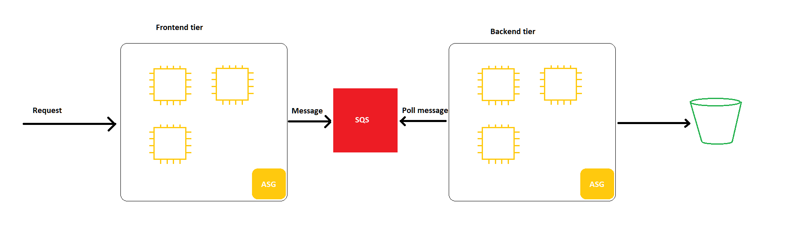
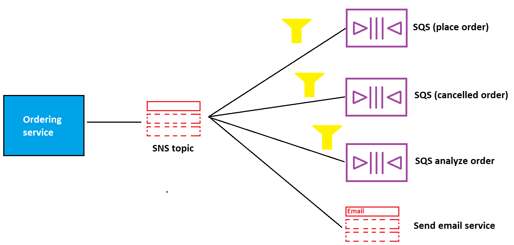
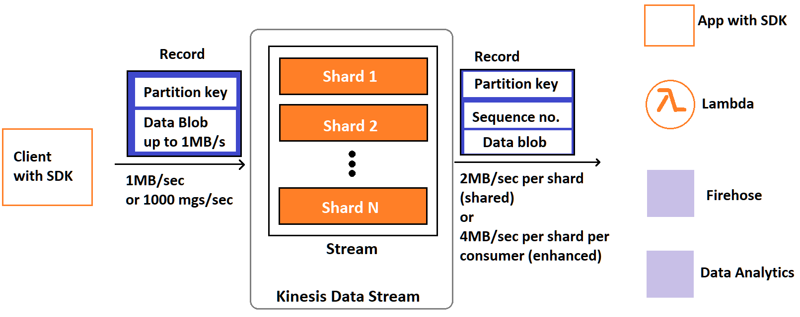

# AWS Integration and Messaging

- SQS queue model
- SNS pub/sub model
- Kinesis: real-time streaming

## SQS
### Standard Queue 
- Oldest offering, fully managed service, userd to **decouple application**
- Unlimited throughput, number of messages in queue
- Retention from 4 -> 14 days max
- Low latency (<10ms)
- Limited 256KB per message sent
- Can have duplicate messages, out of order messages

### How SQS Works
- The `producer` can send message to SendMessage API using SDK
- The message is stored until a `consumer` deletes it
- `Consumers` can run on EC2 instances, Lambda or on-premises
- `Consumber` will poll for messages, up to 10 messages at a time
- `Consumer` then delete the message from queue using DeleteMessage API
- When `consumers` are on EC2 instances, SQS will try its best to distribute messages
- If a `consumer` is busy to process, the messages are processed by another `consumber`, thus best-effort message ordering and at least once delivery
- After done with a message, `consumber` needs to delete that message so that other `consumers` won't consume it again
- We can scale horizontally to increase the throughput
- `CloudWatch` alarm can help trigger `Auto Scaling Group` to scale up when instances are at capacity 

### SQS to decouple between application tiers
- We can have a frontend tier to process incoming files and put to S3, this could take a long time but the files don't have to be processed in real time
- We can set up an SQS queue, when a file comes, the frontend send a message to SQS, a backend app picks up and processes the file synchronously and put to S3
- We can scale frontend and backend tier independently because SQS Queue has unlimited throughput

### SQS Security
- **Encryption**: HTTPS, KMS and client-side
- **Access Control**: IAM policies to regulate access to the SQS API
- **SQS Access Policies**: for cross-account access to SQS Queue, allows other services to write to SQS
  

### Create SQS queue
- Go to `Simple Queue Service` => `Create queue`
- Select Standard queue or FIFO
- Select timeout, retention time ...
- Select managing accounts
- Select encryption key (optional)
- To send a message, go to `Send and receive messages`
- After sending a message, click `Poll for messages` and we can receive the message we just sent
- If we don't delete this message and poll again, we now have 2 duplicate messages
  
### SQS Queue Access Policy 
- Similar to `S3`, allow or deny other accounts to read and write
- To access cross-account, create a queue access policy and attach to the first account, this account can then allow the second account to `PollMessages`
- If we have an `S3` bucket and want to send message to `SQS`, we need to create a policy for `SQS` queue to allow `S3` to `SendMessage` to it with the principal `"*"` so that any account can send message from `S3`, the condition is the ARN of the `S3` bucket

### Message Visibility Timeout
- After a message is polled by consumer, it's invisibile to other consumers
- By default, the visibility timeout is 30 seconds, after this time, it will be put back to the queue
- If the consumber needs more time to process, it can call `ChangeMessageVisibility` API to change the timeout
- Or this can be changed in the console

### Dead Letter Queue
- If a consumer fails to process on time, if this happens very often then there must be something wrong with the message
- We can set a threshold to how many times this can happen and send it to `Dead Letter Queue` for debugging later
- It's good to set the retention of DLQ to 14 days to have time to debug
- After fixing the code, consumer can now reprocess the messages in `DLQ`, we can redrive the messages from `DLQ` back to the main queue

### Delay Queue
- Delay a message, consumer won't see it right away, up to 15 mins
- Default is 0
- Can set default at queue level
- Can override the default on send using `DelaySeconds` param

### Long Polling
- When consumers make too many requests to queue but there is no message, it can wait.
- This is called `LongPoling`
- `LongPolling` decrease number of API calls to SQS while increasing efficiency and latency 
- The wait time is 1 -> 20 seconds, 20 is preferable
- `Long Poling` is preferable to `Short Polling`
- `LongPolling` can be enabled at queue level

### Extended Client
- We can use `SQS Extended Client` (Java Library) to extend size of messages
- It uses S3 to store the messages and send metadata to the queue to reference to the bucket
- The client will also use `SQS Extended Client` to read the metadata and download message from S3

### Must know API
- `CreateQueue`, `DeleteQueue`
- `PurgeQueue`: delete all messages in queue
- `SendMessage`, `ReceiveMessage`, `DeleteMessage`
- `MaxNumberOfMessages`: default 1, max 10
- `ReceiveMessageWaitTimeSeconds`: Long Polling
- `ChangeMessageVisibility`: change message timeout 

### SQS FIFO
- First In First Out (ordering in queue)
- **Limited throughput** because of ordering
- FIFO has a feature `Deduplication`, if enabled, it prevent duplication in an interval of 5 minutes
- `Deduplication` can base on:
  - Hashing of content
  - We can explicitly provide a `Message Deduplication ID` so that the following messages with this ID can be ignored
- `Message Grouping` is when you specify the value of `MessageGroupID` in an FIFO queue.
- Messages that have the same `MessageGroupID` can only be processed by 1 consumer
- Ordering across groups is *not guaranteed*
- The idea is to distribute groups to different consumers to achieve *parallel processing*
- Can have as many consumers as `MessageGroupID`

## Amazon SNS
- Pub/Sub
- The producer only sends message to 1 topic
- The messages are not persisted, when SNS receives a message, it sends to whatever avaiable subscribers then deletes the message, if no subscribers are there then the message is lost
- As many event receivers as we want
- Up to 12,500,000 subscriptions per topic
- 100,000 topics limit
- `SNS` can send email, sms, http, to `SQS`, Lambda
- Many AWS services can send messages directly to `SNS`
- Same security as `SQS`, in flight HTTPS default, `SNS Access Policies` similar to `SQS` and `S3`

### SNS + SQS: Fan Out
- Push once in `SNS`, receive in all `SQS` queues that are subscribers
- `SNS` => `SQS` => consumers
- Fully decoupled, no data loss
- `SQS` allows for data persistence, delayed processing and retries of work
- Ability to add more `SQS` consumers over time
- Make sure `SQS` queue access policy allows SNS to write
- We can do this not only to `SQS` but also to `Kinesis`, `Lambda` functions and so on

### Message Filtering
- JSON policy used to filter messages sent to SNS topic's subscriptions
- If a subscription doesn't have a filter policy, it receives every message

### Create SNS Topic
- Go to `SNS` => `Create Topic`
- This is similar to `SQS`, the topic could be `Standard` or `FIFO` (ends with .fifo)
- Specify `Access Policy` for other accounts or services => `Create topic`
- To subscribe, we need to create subscription
- Go to the topic => `Create subscription`
- The protocol could be:
  - `Kinesis`
  - `SQS`
  - `Lambda`
  - `Email`
  - `Email-JSON`
  - `HTTP`
  - `HTTPS`
  - `Platform application endpoints`
  - `SMS`
- Specify the endpoint of the protocol (email address, ARN or URL...)
- It's optional to select filtering policy and redrive policy for dead letter queue

## Kinesis (**NEED TO KNOW IN DEPTH**)
- Make it easy to collect, process and analyze streaming data in real-time
- Ingest real-time data such as Application logs, Metrics, Website clickstream
- `Kinesis Data Stream`: capture, process and store data streams
- `Kinesis Data Firehose`: load data streams into AWS data stores
- `Kinesis Data Analytics`: analyze data stream with SQL or Apache Flink
- `Kinesis Video Streams`: capture, process and store video streams

### Kinesis Data Stream
- Stream big data in systems
- Contains of Shards from Shard 1 -> N, the stream is split across all the shards
- When a producer (apps using SDK) sends data to Kinesis
- The data record has a `partition key` and a `data blob`
- The `key` decides what shard it goes to
- It can sends 1MB/sec or 1000 msg/sec per shard
- The consumers could be apps with `SDK`, `Lambda`, `Firehose`, `Data Analytics`
- Retention 1 -> 365 days
- Ability to reprocess(replay) data
- Once data is inserted in Kinesis, it can't be deleted (immutability)
- Data that shares the same partition goes to the same shard (ordering)
- Producers could be `AWS SDK`, `Kinesis Producer Library(KPL)`, `Kinesis Agent`
- Consumbers could be apps with `Kinesis Client Library(KCL)`, `AWS SDK`, `Lambda`, `Firehose`, `Data Analytics`

#### Capacity Modes
- **Provision Mode:**
  - Choose number of shards, scale manually or using API
  - Each shard gets 1MB/s in (1000 records per sec)
  - Each shard gets 2MB/s out (classic or enhanced fan-out consumer)
  - Pay per shard provisioned per hour
- **On-demand mode**
  - No need to provision or manage the capacity
  - Default capacity 4MB/s or 4000 records/s
  - Scale automatically based on observed throughput
  - Pay per stream per hour & data in/out per GB

#### Security
- Control access/authorization using `IAM policies`
- Encryption in flight using HTTPS and at rest using `KMS`
- Can implement en/decryption on client side (harder)
- Other services within VPC can call Kinesis Data Streams without going through the internet
- `CloudTrail` can monitor

#### Kinesis Producer
- Put data records into data streams
- Data record consists of:
  - `Sequence number` (unique per partition key within shard)
  - `Paritition key` (must specify while put records into stream)
  - `Data blob` (up to 1 MB)
- Write throughput 1MB/sec or 1000 records/sec per shard
- `PutRecord` API
- Use batching with `PutRecords` API to reduce costs and increase throughput 
- The parition key is **hashed** to decide which shard to go to
- If we have `ProvisionedThroughputExceeded`, use highly distributed partition key, retries with exponential backoff and scale up shards 

#### Kinesis Consumer
- Get data from data stream then process
- `Shared (Classic) Fan-out Consumer:`
  - 2MB/sec/shard across all consumers
  - All consumers can share 2MB/sec
  - 5 get record API calls/sec/shard
  - Minimize cost
  - Latency 200ms
  - Poll data using `GetRecords` API
- `Enhanced Fan-out Consumer:`
  - 2MB/sec/shard/consumer
  - Consumers won't share throughput
  - Latency 70ms
  - High cost
  - Push data using HTTP/2 `SubscribeToShard` API
- Lambda can support both Classic and Enhanced 
- Lambda reads records in batches using GetBatch(), can configure batch size, window
- Lambda can retry on failure

#### Create Kinesis Data Stream
- Go to Kinesis => Create Kinesis data stream
- Select On-demnand or Provisioned (On-demand does not require provision the number of shards)

#### Kinesis Client Library (KCL)
- A Java lib that helps read records from KDS
- Each shard can only be read by 1 KCL instance max
  - 4 shards = max 4 KCL instances
- Process is checkpointed into DynamoDB (needs IAM access)
- It's able to track other workers and share the work amongst shared thanks to MongoDB
- Can run on EC2, Beanstalk, on premises
- Records are read in order at the shard level

#### Shard Splitting
- Used to increase stream capacity since 1MB/s/shard
- Used to devide a hot shard
- The old shard is closed and will be deleted once the data expires
- No automatic scaling
- Can't split into more than 2 shards in a single operation
- Shard Splitting splits a shard into 2 if it's too hot while Auto Scaling increase number of shards which does not solve the hot shard issue

#### Merging Shards
- Can group 2 shards having low traffic into 1 new shard
- Save cost
- Can't merge more than 2 shards/operation
- Old shards are closed and deleted once data expires

## Kinesis Data Firehose
- Take data from producers including `Kinesis Data Stream`
- It can optionally transform data using `Lambda`
- Batch writes to destination without additional code
- Destinations:
  - S3
  - AWS Redshift (copy from S3 first then Firehose issues a copy command)
  - AWS ElasticSearch
  - Custom destinations
  - Some partners 
- Can store back up in S3
- No administration, auto scaling, serverless
- Pay for data going through Firehose
- Near Real Time because we need to write in batch so there is 60 secs latency or min 32MB of data at a time
  
### Firehose vs Data Stream
- `Data Stream` is a streaming service that ingests data at scale, need to write code, at real time, manage scaling, data storage from 1->365 days, supports replay
- `Firehose` is a streaming service that ingests data and streams into other AWS services, fully managed, no need to manage scaling, near real time, cannot store or replay data

### Create Data Firehose
- Create a data stream (in Kinesis Data Stream)
- Go to `Kinesis` => `Delivery Stream` => `Create delivery stream`
- Select `Source` and `Destination`
- Select data stream
- Can select Lambda to transfer optionally
- Select S3 buffer size/interval to config when the data is delivered
- Let AWS create new IAM role or select an existing one
- Create delivery stream

## Kinesis Data Analytics
- Source from Data Stream or Firehose
- Use SQL to analyze data
- Perform real time analytics, charge over data 
- Auto scaling