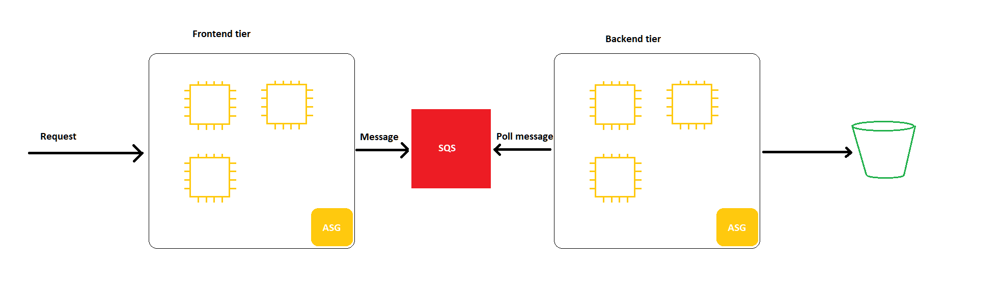

# AWS Integration and Messaging

- SQS queue model
- SNS pub/sub model
- Kinesis: real-time streaming

## SQS
### Standard Queue 
- Oldest offering, fully managed service, userd to **decouple application**
- Unlimited throughput, number of messages in queue
- Retention from 4 -> 14 days max
- Low latency (<10ms)
- Limited 256KB per message sent
- Can have duplicate messages, out of order messages

### How SQS Works
- The `producer` can send message to SendMessage API using SDK
- The message is stored until a `consumer` deletes it
- `Consumers` can run on EC2 instances, Lambda or on-premises
- `Consumber` will poll for messages, up to 10 messages at a time
- `Consumer` then delete the message from queue using DeleteMessage API
- When `consumers` are on EC2 instances, SQS will try its best to distribute messages
- If a `consumer` is busy to process, the messages are processed by another `consumber`, thus best-effort message ordering and at least once delivery
- After done with a message, `consumber` needs to delete that message so that other `consumers` won't consume it again
- We can scale horizontally to increase the throughput
- `CloudWatch` alarm can help trigger `Auto Scaling Group` to scale up when instances are at capacity 

### SQS to decouple between application tiers
- We can have a frontend tier to process incoming files and put to S3, this could take a long time but the files don't have to be processed in real time
- We can set up an SQS queue, when a file comes, the frontend send a message to SQS, a backend app picks up and processes the file synchronously and put to S3
- We can scale frontend and backend tier independently because SQS Queue has unlimited throughput

### SQS Security
- **Encryption**: HTTPS, KMS and client-side
- **Access Control**: IAM policies to regulate access to the SQS API
- **SQS Access Policies**: for cross-account access to SQS Queue, allows other services to write to SQS
  

### Create SQS queue
- Go to `Simple Queue Service` => `Create queue`
- Select Standard queue or FIFO
- Select timeout, retention time ...
- Select managing accounts
- Select encryption key (optional)
- To send a message, go to `Send and receive messages`
- After sending a message, click `Poll for messages` and we can receive the message we just sent
- If we don't delete this message and poll again, we now have 2 duplicate messages
  
### SQS Queue Access Policy 
- Similar to `S3`, allow or deny other accounts to read and write
- To access cross-account, create a queue access policy and attach to the first account, this account can then allow the second account to `PollMessages`
- If we have an `S3` bucket and want to send message to `SQS`, we need to create a policy for `SQS` queue to allow `S3` to `SendMessage` to it with the principal `"*"` so that any account can send message from `S3`, the condition is the ARN of the `S3` bucket

### Message Visibility Timeout
- After a message is polled by consumer, it's invisibile to other consumers
- By default, the visibility timeout is 30 seconds, after this time, it will be put back to the queue
- If the consumber needs more time to process, it can call `ChangeMessageVisibility` API to change the timeout
- Or this can be changed in the console

### Dead Letter Queue
- If a consumer fails to process on time, if this happens very often then there must be something wrong with the message
- We can set a threshold to how many times this can happen and send it to `Dead Letter Queue` for debugging later
- It's good to set the retention of DLQ to 14 days to have time to debug
- After fixing the code, consumer can now reprocess the messages in `DLQ`, we can redrive the messages from `DLQ` back to the main queue

### Delay Queue
- Delay a message, consumer won't see it right away, up to 15 mins
- Default is 0
- Can set default at queue level
- Can override the default on send using `DelaySeconds` param

### Long Polling
- When consumers make too many requests to queue but there is no message, it can wait.
- This is called `LongPoling`
- `LongPolling` decrease number of API calls to SQS while increasing efficiency and latency 
- The wait time is 1 -> 20 seconds, 20 is preferable
- `Long Poling` is preferable to `Short Polling`
- `LongPolling` can be enabled at queue level

### Extended Client
- We can use `SQS Extended Client` (Java Library) to extend size of messages
- It uses S3 to store the messages and send metadata to the queue to reference to the bucket
- The client will also use `SQS Extended Client` to read the metadata and download message from S3

### Must know API
- `CreateQueue`, `DeleteQueue`
- `PurgeQueue`: delete all messages in queue
- `SendMessage`, `ReceiveMessage`, `DeleteMessage`
- `MaxNumberOfMessages`: default 1, max 10
- `ReceiveMessageWaitTimeSeconds`: Long Polling
- `ChangeMessageVisibility`: change message timeout 

### SQS FIFO
- First In First Out (ordering in queue)
- **Limited throughput** because of ordering
- FIFO has a feature `Deduplication`, if enabled, it prevent duplication in an interval of 5 minutes
- `Deduplication` can base on:
  - Hashing of content
  - We can explicitly provide a `Message Deduplication ID` so that the following messages with this ID can be ignored
- `Message Grouping` is when you specify the value of `MessageGroupID` in an FIFO queue.
- Messages that have the same `MessageGroupID` can only be processed by 1 consumer
- Ordering across groups is *not guaranteed*
- The idea is to distribute groups to different consumers to achieve *parallel processing*