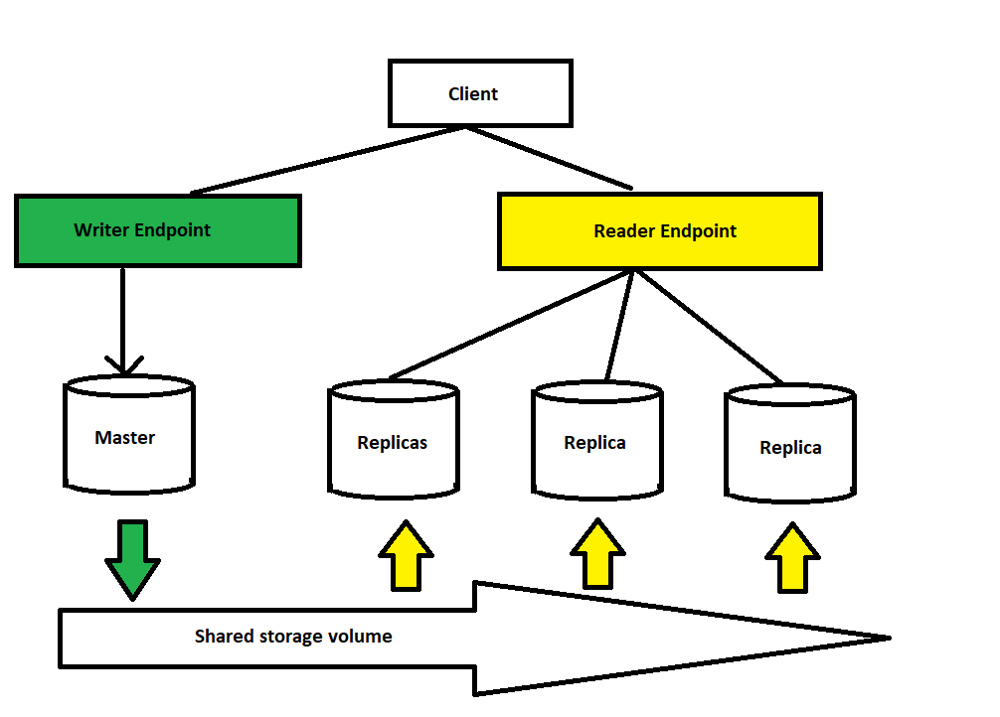

**RDS - Relational database service**

- It's a managed DB with SQL as query language
- Allow to create DB such as:
  - Postgres 
  - MySQL
  - MariaDB
  - Oracle
  - MS SQL Server
  - Aurora

***Advantages vs EC2 hosted DB***
  1. It's a managed service
  2. Auto provisioning, OS update
  3. Continuous backup and restore to specific timestamp
  4. Monitor dashboard
  5. Multi AZ
  6. Scaling vertical and horizontal

***RDS Backup***
- Enabled automatically
- Daily full backup
- Transaction logs are backed up by RDS every 5 mins
- Restore to any point in time
- Retention for 7 days but can increase to 35

***Storage auto scaling***
- Helps increase the storage dynamically when detects running out of storage
- Need to set Maximum Storage Threshold

***Read Replicas vs Multi AZs*** *(Important for the exam)*

*RDS Read Replicas:*
- Helps read faster
- Can create up to 5 replicas
- Can be same AZ, cross AZ or cross region
- Can be out of sync at time, but eventually consistent
- Can only use keyword SELECT to read data, not write
- Charges for cross region
- There is 1 DNS name, if the master DB fails, the DNS automatically switch to the failover replica, no manual intervention needed to the app
- Cross AZ needs to be enabled to recover in case an entire AZ fails.
- The failover replica is not used for read, write or scaling, only used when there is a failure.

*From Single-AZ to Multi-AZ*
- Zero downtime operation, just need to click Modify for the DB
- AWS auto takes snapshot and sets up the replica.

***RDS Security - Encryption***
There are 2 types of encryption
- At rest encryption:
  - Encryption has to be defined at launch time
  - Replicas can only be encrypted if master is encrypted

- In-flight encryption
  - Provide SSL options with trust certificate when connecting to DB
  - To enforce SSL:
    - For postgres: rds.force_ssl=1 in the AWS RDS console
    - For MySQL: *GRANT USEAGE ON *.* TO 'mysqluser'@'%' REQUIRE SSL;*

*Encrypting RDS backups:*
- Snapshots of unencrypted DB are unencrypted and via versa
- Can copy a snapshot into an encrypted one

*To encrypt a DB:*
- Take a snapshot of the DB
- Copy the snapshot into an encrypted snapshot
- Restore the encrypted snapshot into a new encrypted DB
- Connect the app the new encrypted DB
- Delete the old DB

- RDS DBs are usually deployed within a private subnet, not public
- They use security groups to decide who can access the DBs
- IAM policies help control who can manage RDS (create, delete), for traditional operations, still need to use username and password

- RDS - IAM authentication only works with Postgres and MySQL
- Use a token, acquired via IAM & RDS API calls, to access, no need for password
- The token has a lifetime of 15 mins
- Benefits of using IAM authentication:
  - Network in/out is encrypted with SSL
  - IAM to manage users instead of DB
  - Can leverage AIM Roles and EC2 instance profiles for easy integration

**Amazon Aurora**
- Not open-source
- Postgres and MySQL drivers work with Aurora
- Cloud optimized, 5x performance over MySQL and 3x over Postgres
- Auto scale in increment of 10gb, to 128 TB, can have 15 replicas while MySQL can only have 5
- High availability native, failover is instantaneous, self healing with peer-to-peer replication, storage is tripped across 100s volumes.
- Cost more than RDS but more efficient
- Auto creates 6 copies across 3 AZ
- 1 master replica to take writes, failover takes only 30 secs
- Master + up to 15 replicas
- Supports cross region replication
- Read and write to Aurora with load balancer endpoints

*Aurora Security*
- Similar to RDS because using the same engines
- Encryption at rest using KMS
- Auto backups, snapshots, replicas are all encrypted
- Encryption in flight using SSL
- Can authenticate using IAM token
- You're responsible to protect the instance with security group
- Can't SSH

**Elastic Cache**

Elastic cache - Redis vs Memcached

*Redis:*
- Allow multi AZ with auto-failover
- Read replicas to scale reads and have high availability
- Data durability using AOF persistence
- Backup and restore

*Memcached*
- Multi-node for partioning 
- No availability
- Non persistence
- No backup and restore
- Multi-threaded architecture

*Lazy Loading / Cache-Aside / Lazy Population*
- App asks cache for data, cache hit
- If there is data then the cache returns it
- If there is no data then there is a cache miss
- App asks database for data
- App write new data to the cache
- Cache miss could delay the read

*Write through*
- App asks for data, cache hit
- When app updates the DB, it also write to cache
- Reads are quick but writes are slow
- A lot of data that never read
- Should use in tandem with Lazy Loading

Cache eviction and Time-to-live(TTL)
- Cache eviction can happens when explicitly delete the data, out of memory or TTL expires
- TTL can range from a few secs to days

*Elastic Cache Replication*
***Cluster Mode Disabled***
- Up to 5 replicas
- Asycn replication
- Primary node is for read and write, secondary nodes are for read-only
- One shard, all nodes have all the data
- Guard against data loss if node failure
- Multi-AZ by default

***Cluster Mode Enabled***
- Data is partitioned across shards, good for writes
- Each shard has a primary and up to 5 replica
- Multi-AZ capability
