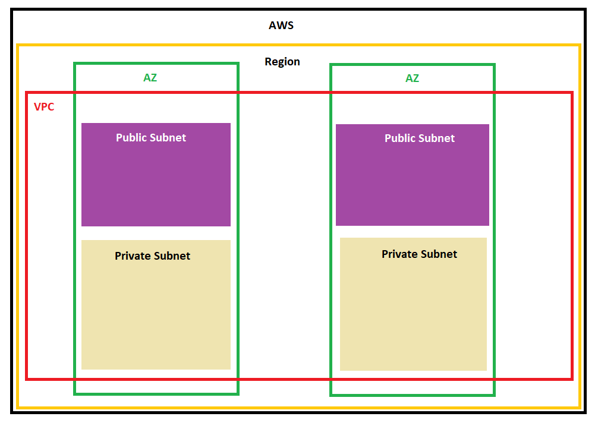
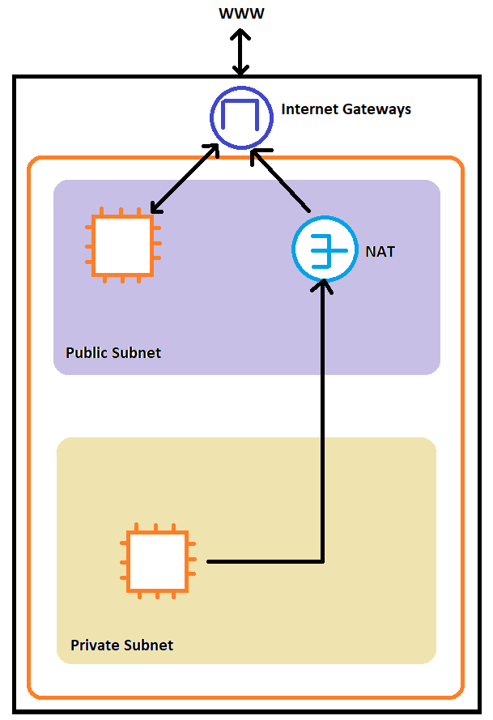

**Virtual Private Cloud**

- A private network to deploy resources, region bound.
- A subnet partitions the network inside VPC, AZ bound. 
- There are public and private subnets
- To define the access to the internet and between subnets, we use RouteTable
- Each region has a default VPC created for you.
- For VPC created on AWS, it only has a public subnet

***Internet Gateways***

- Internet Gateways help connect VPC instances to the internet
- Public subnets have a route to the Internet Gateways
- NAT Gateways (NAT Instance) allows private subnets to access internet while remaining private.

***Network ACL and Security Group***

Network ACL
- First firewall layer of a subnet
- Can have ALLOW or DENY rule
- Attached to Subnet level
- Rules only include IP addresses
- By default, NACL allows all in and out

Security Group
- Behind Network ACL, at level of EC2
- A firewall that controls traffic from to an ENI/EC2 instance
- Can have only ALLOW rules
- Rules can include IP addresses or other security groups

***VPC Flow Logs***
- Captures information about IP traffic going to the interfaces
- Helps to monitor and troubleshoot connectivity issues
- Captures network info from AWS managed interfaces like ELB, Cache, RDS, ...
- Log dta can gogto S3 / CloudWatch Logs

***VPC Peering***
- Connect 2 VPC privately using AWS's network
- Make them behave as if they're the same network
- Must not have overlapping CIDR (IP address range)
- VPC Peering connection is not transitive, if A -> B, A -> C, C is not connected to B. They have to be manually connected.

***VPC Endpoints***
- Allow to connect to AWS services using a private network instead of www network
- This gives enhanced security and lower latency
- VPC Endpoint Gateway: S3 and DynamoDB
- VPC Endpoint Interface: the rest
- Only used within your VPC
- If the exam wants to connect 2 AWS services privately then VPC Endpoints is the way.

***Site to Site VPN and Direct Connect***
By default, resources in an Amazon VPC cannot connect to a on-premises. There are 2 ways to connect:
- Site to Site VPN:
  - Connect an on-premises VPN to AWS
  - The connection is automatically encrypted
  - Goes over the internet
- Direct Connect
  - Having a physical connection between on-premises and AWS
  - The connection is private, secure and fast
  - Goes over private network
  - Takes at least a month to set up